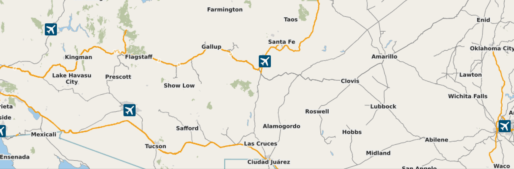

# Project-5-CS2334-
This is one of my works from My CS class programming abstraction(CS2334) taken at the University of Oklahoma
# Project 5: Java GUI

In Project 5, you will be implementing a map GUI for the triplog dataset which we have been working with over the course of the semester. Last project, you implemented a couple methods of stop detection in order to remove excess points. Now it is time to plot those points on a map and do a simple animation of the path. You will be given a completed TripPoint class (you should not have to edit this class at all). Your task will be to create any classes or methods required in order to implement the GUI map and components as well as the simple animation. To help you, an outline of the steps required is provided in the Driver.java class. You are not required to follow the outline. 

## Mapping Libraries

You are allowed to use any external libraries for your map. However, the jar file for JMapViewer is included in your repo under the lib directory. If you choose to use it, you can learn about JMapViewer from the github page [here](https://github.com/openstreetmap/svn-archive/tree/main/applications/viewer/jmapviewer). There is Demo included there under src/.../jmapviewer which gives an overview of all the basic mechanics of JMapViewer you will need for this project. 

## Required GUI Components and Functionality

Your program should include three main components in addition to your map. 

1) A JComboBox to select the animation time in seconds. The options should be 15, 30, 60, and 90 seconds.
2) A JCheckBox to select whether or not stops should be included. It should default to unchecked, which means do not include stops. 
3) A JButton to play / reset the animation. When the play button is pressed, the animation should begin with the animation speed that is currently selected in the ComboBox, and with or without stops based on whether the CheckBox is checked. It should also remove the leftover track if the animation was played previously, so that the next animation has a blank map to work on. 

An example of what this could look like:

Also, include your name in the title of the window:

## The Animation

The animation should be a simple animation where the current position is tracked by an image, and a line should be left behind showing the path that was taken to the current position. The image that you should use for the current position is a [raccoon head](./raccoon.png) that is provided for you in the repo. If you use JMapViewer, there is no built-in map marker for images, so you can use the included [IconMarker.java](./src/IconMarker.java).

As discussed already, the animation should be able to accomodate being 15, 30, 60, or 90 seconds in length depending on the selection of the JComboBox. It should also be able to accomodate animating the path either with or without stops included. For stop detection feel free to use either h1 or h2 stop detection. 

Also, the map should center on the area where the animation takes place. That way you can see the whole animation play out without having to move the map at all. You can either hardcode this, or do it dynamically depending on the track that is loaded. 

